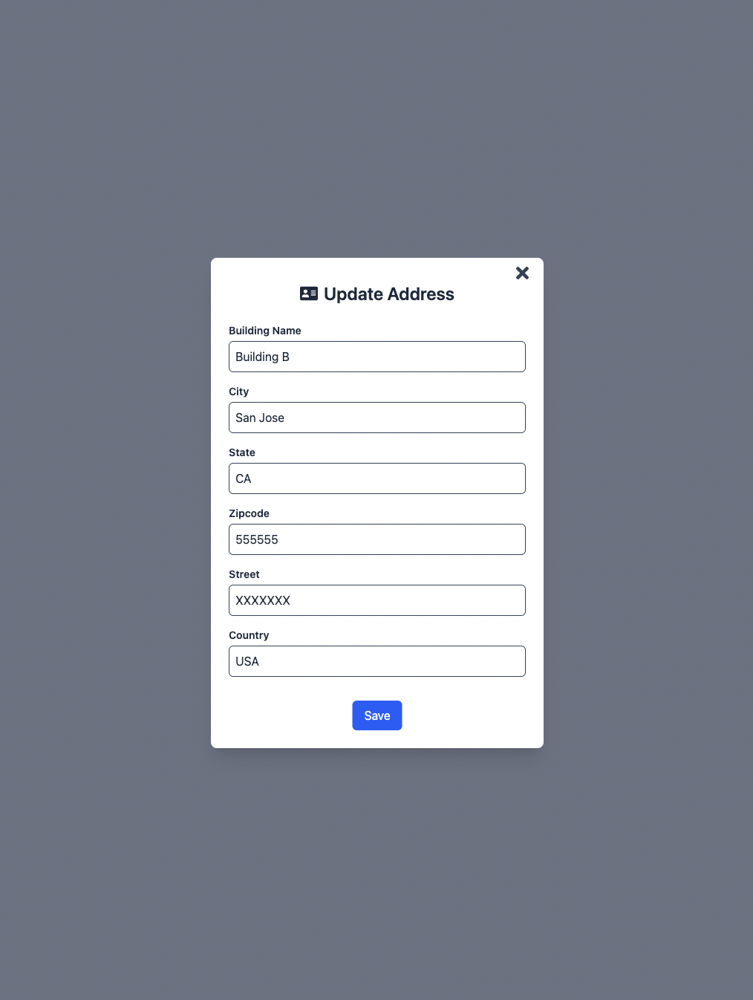
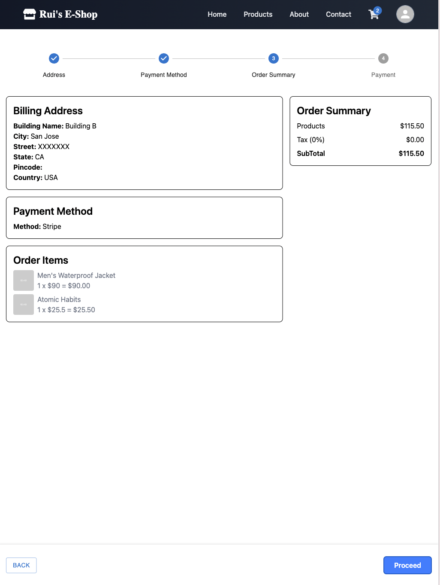

## 🛒 E-Commerce Platform Demo

This project is a full-featured, production-grade e-commerce web application built with **Spring Boot (backend)** and **React (frontend)**. It supports secure authentication, dynamic product browsing, cart and order management, and seamless Stripe-based payment.

---

### Key Features

- 🔐 **User Authentication**: Register, Login, and Role-Based Access Control (JWT-secured)
- 🛍️ **Product Catalog**: Grid listing with search, sorting, and filtering
- 📦 **Shopping Cart**: Add/remove products, quantity management
- 🚚 **Checkout Flow**: Address selection, payment method, and order review
- 💳 **Stripe Payment Integration**: Secure and testable checkout via `react-stripe-js`
- 🧾 **Order Confirmation**: Dynamic order summary with success screen
- 🧑‍💼 **Admin Panel**: Product CRUD, inventory updates, and management features

---

### Screenshots

Here are some UI previews of the final product:

| Page             | Preview                                              |
|------------------|------------------------------------------------------|
| Home Page        |                   |
| Product Listing  |               |
| Sort Component   |                       |
| About / Contact  |   |
| Login            |                     |
| Cart / Checkout  |               |
| Address Select   |                 |
| Address Update   |     |
| Payment Method   |           |
| Stripe Integration |                 |
| Order Summary    |            |
| Order Success    |      |

---

### Frontend Stack

- **React** with Hooks and functional components
- **Redux Toolkit** for global state management (cart, auth, checkout)
- **React Router DOM** for dynamic routing
- **Tailwind CSS** for responsive and consistent UI
- **LocalStorage** for persistence of cart and address data
- **Stripe.js** (`@stripe/stripe-js`, `react-stripe-js`) for client-side payment workflow

---

### Backend Stack

- **Spring Boot** as the core application framework
- **Spring Security** with **JWT** for stateless authentication and authorization
- **Spring Data JPA + Hibernate** for ORM and repository abstraction
- **RESTful API** design using Spring MVC
- **MySQL / PostgreSQL** database support *(PostgreSQL used in dev, optional RDS in prod)*
- **Stripe Java SDK** for secure server-side payment verification
- **Exception Handling** with global `@ControllerAdvice` and custom responses

---

### DevOps & Deployment (Optional)

- **Dockerized** for backend packaging
- **AWS EC2** for server deployment
- **AWS RDS** for managed MySQL/PostgreSQL instances
- Environment variables configured via `.env` and `application.properties`

---

### Architecture Highlights

- Decoupled **frontend/backend** with clean REST boundaries
- JWT + Role-based access enables **admin/user isolation**
- Inventory quantity updated **atomically during checkout**
- Stripe tokenization ensures **PCI-compliant payment processing**

---
