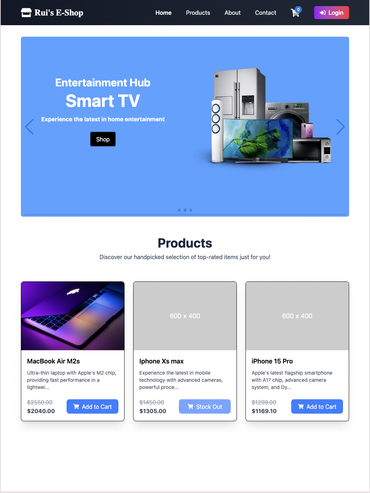
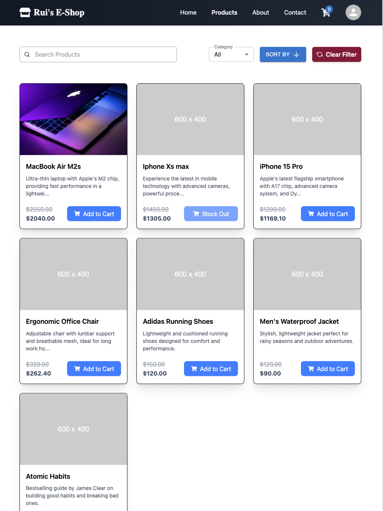
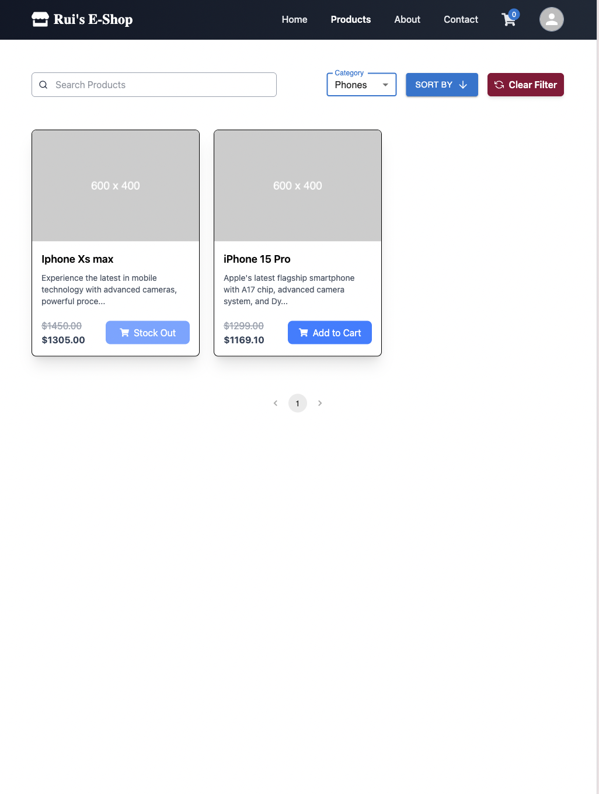
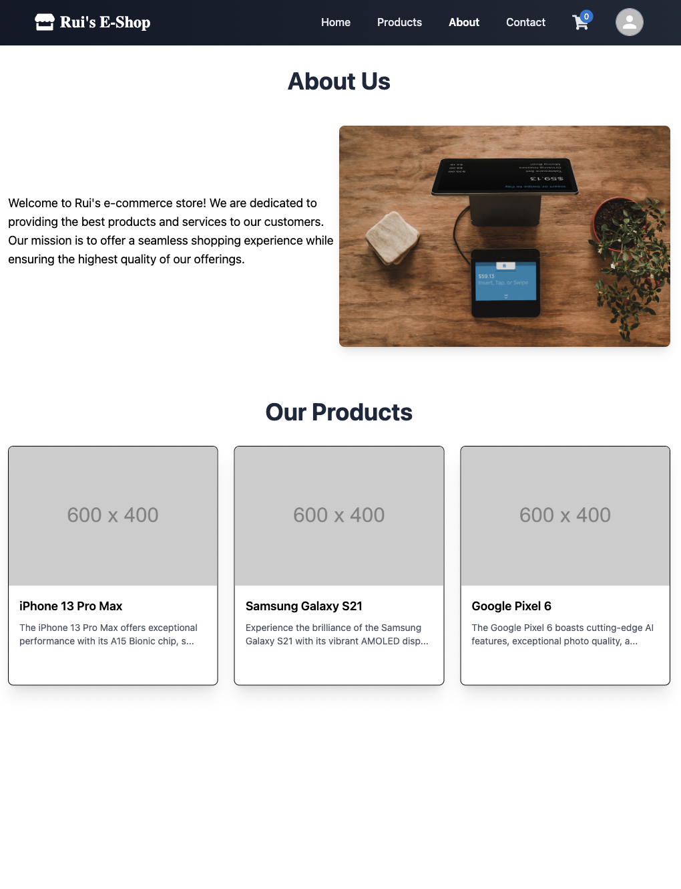
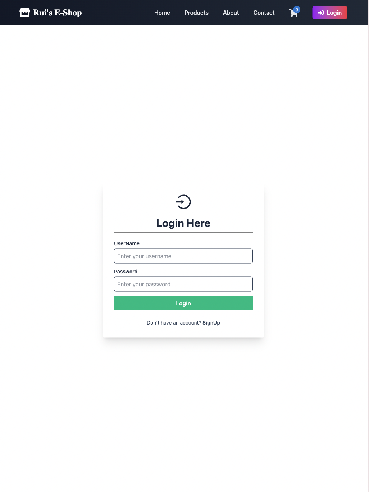
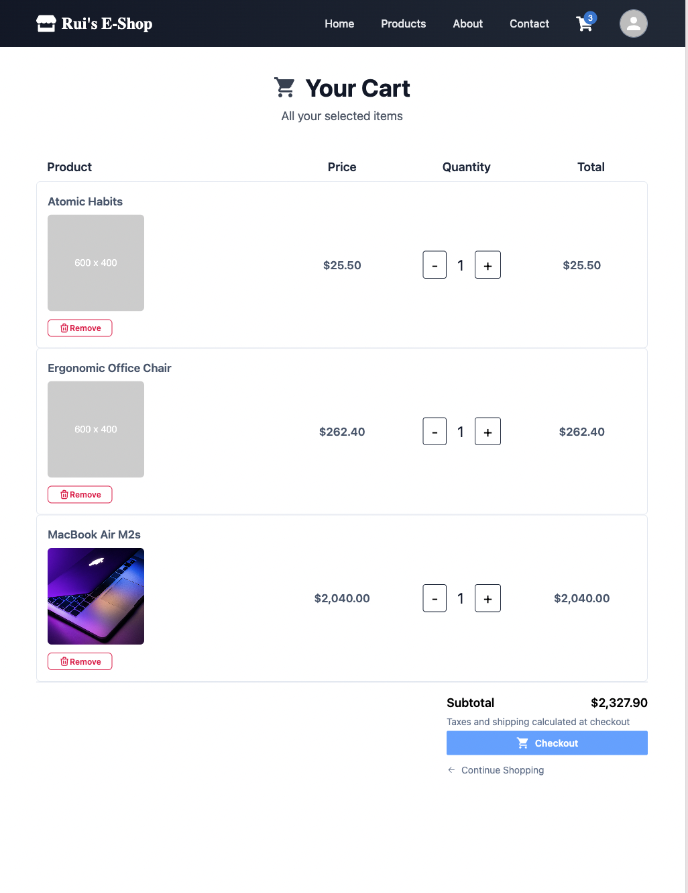
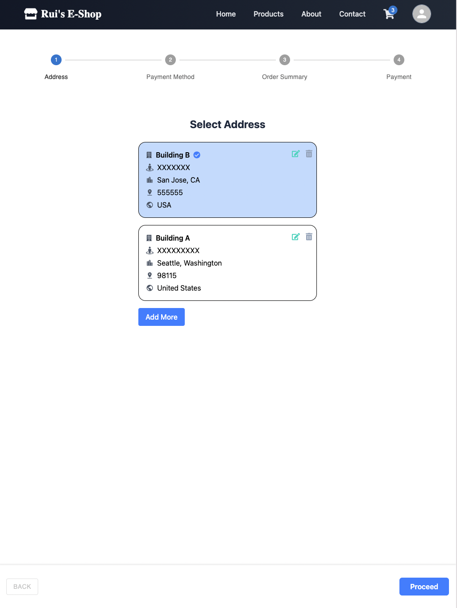
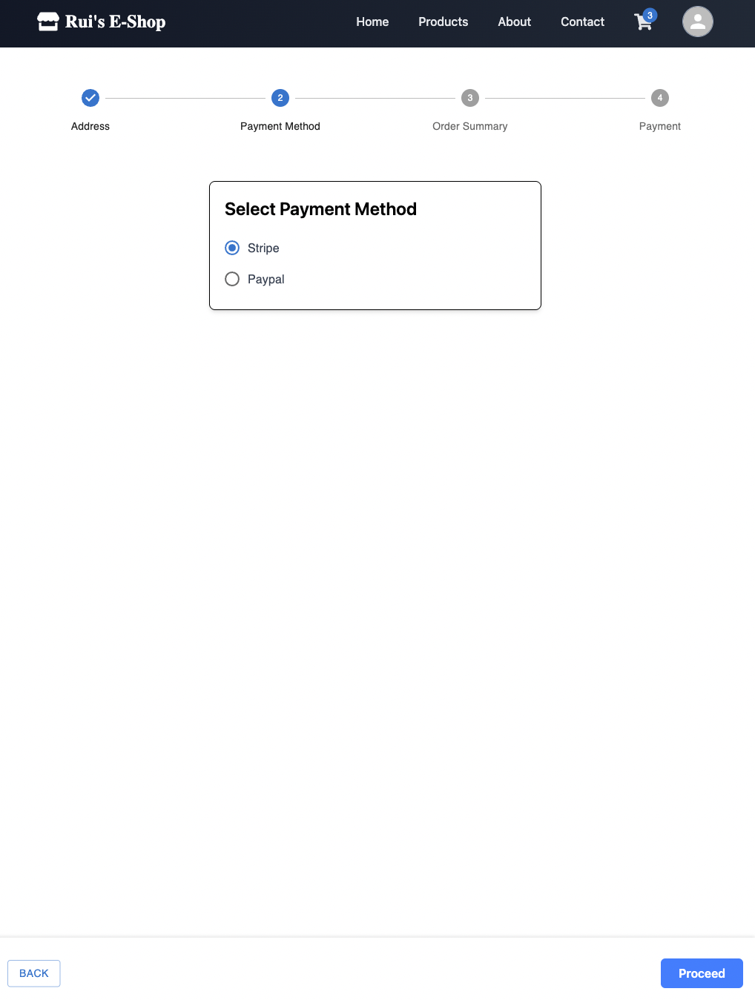
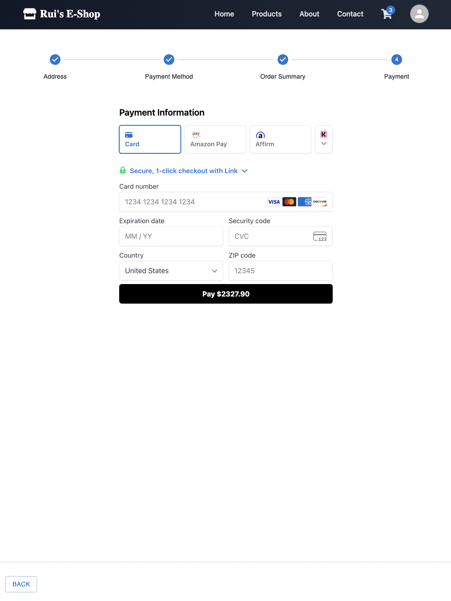

## 🛒 E-Commerce Platform Demo

This project is a full-featured e-commerce web application built with Spring Boot (backend) and React (frontend). It supports user authentication, product browsing, cart management, checkout, and payment via Stripe.

### ✅ Key Features

- 🔐 User Sign In and Sign Up / Login with JWT authentication  
- 🛍️ Product Listing with Sorting and Filtering  
- 📦 Add to Cart and Cart Quantity Management  
- 🚚 Address Selection at Checkout  
- 💳 Stripe Payment Integration  
- 🧾 Order Summary and Success Page  
- 🧑‍💼 Admin Panel for Product Management 

### 🖼️ Screenshots

Here are some UI previews of the final product:

| Page             | Preview                                              |
|------------------|------------------------------------------------------|
| Home Page        |                   |
| Product Listing  |               |
| Sort Component   |                       |
| About / Contact  |   |
| Login            |                     |
| Cart / Checkout  |               |
| Address Select   |                 |
| Payment Method   |           |
| Stripe Integration |                 |
| Order Success    |      |

### 📦 Tech Stack

- **Frontend**: React, Redux, Tailwind CSS  
- **Backend**: Spring Boot, Hibernate, JPA  
- **Database**: MySQL  
- **Security**: JWT, Spring Security  
- **Payments**: Stripe API  
- **DevOps**: Docker, AWS EC2/RDS *(optional)*

