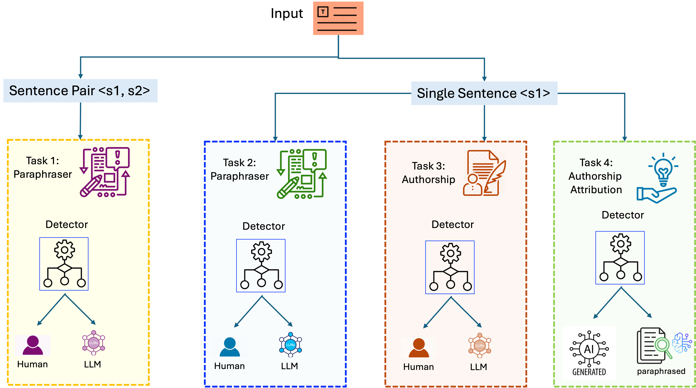

# PLD-4: A Multi-Task Framework for Detecting and Attributing LLM-Generated Paraphrases

## Project Overview

The rapid advancement of Large Language Models (LLMs) has made it increasingly difficult to differentiate between human and machine-generated text. This issue is particularly challenging when LLMs are used to **paraphrase** existing content—a technique often used to evade detection and which impacts academic integrity, intellectual property, and the spread of misinformation.

To address this, we introduce the **Paraphrase-based LLM Detection Framework (PLD-4)**, a novel benchmark that formalizes LLM-generated paraphrase detection into four distinct subtasks. These tasks are designed to evaluate detection methods across realistic and challenging scenarios, including the identification of **layered AI-generated content**.

## Framework Overview

---

## 🔍 Defines Four Complementary Tasks

1. **Sentence Pair Paraphrase Detection**  
   Given two input sentences, determine if the second sentence in the pair is paraphrased by Human or a Large Language Model (LLM).

2. **Single Sentence Paraphraser Detection**  
    Given a single input sentence known to be a paraphrase, determine if the paraphrasing was generated by an LLM or by human.

3. **Single Sentence Authorship Attribution**  
   Determine whether a given sentence -either original or paraphrased- was authored by a human or generated by an LLM.

4. **Single Sentence AI Authorship Attribution**  
    Given a machine-generated sentence, determine whether it was directly generated from a LLM or is a paraphrased version of an LLM output produced by another LLM. 

---

## Methodology

Our approach adopts a **dual modeling strategy**, combining traditional feature-based machine learning with modern transformer-based architectures for both interpretability and performance.

### Feature-Based Models
We engineered **39 linguistic and stylistic features** to train an XGBoost classifier, optimized for sentence-pair tasks where the original (human-written) text is known.

### Transformer-Based Models
We fine-tuned **DeBERTa-v3** and **RoBERTa** for single-sentence classification tasks, leveraging their deep contextual understanding to detect subtle linguistic traces left by LLMs.

> **Datasets Used**:
- [Microsoft Research Paraphrase Corpus (MRPC)](https://www.microsoft.com/en-us/download/details.aspx?id=52398)
- Human-LLM Paraphrase Collection (HLPC)

---

## Key Findings

Our experiments reveal both strengths and limitations of current detection techniques:

### Task 1: Sentence Pair Paraphrase Detection 
- **Model**: XGBoost
- **Accuracy**: 96%
- **AUROC**: 0.9876 (on adapted MRPC)

### Task 2: Single Sentence Paraphraser Detection
- **Model**: RoBERTa
- **Accuracy**: 92.44%

### Task 3: Single Sentence Authorship Attribution
- **Model**: RoBERTa
- **Accuracy**: 93.94%

### Task 4: Single Sentence AI Authorship Attribution
- **Model**: RoBERTa
- **Accuracy**: 83.28%
- This task was the most challenging, demonstrating the difficulty of detecting **layered AI generation**.

---

## Limitations

Several limitations should be noted:

- The LLMs used for paraphrasing (e.g., GPT2-XL, BART, Dipper) may not reflect the capabilities of the latest generation of models.
- The findings are dataset-specific and may not generalize to other domains or languages.
- Some single-sentence tasks used relatively small datasets (~1,800 samples), which may limit statistical power.
- This work focuses on **sentence-level** detection, not document-level or mixed-authorship analysis.

---

## Conclusion

The **PLD-4 framework** establishes a structured benchmark for detecting and attributing paraphrases generated by LLMs. While we show that paraphrasing introduces stylistic signals detectable by both feature-based and transformer models, **layered LLM output remains a significant challenge** for current detectors.

> **Future Work**: We aim to explore adversarial robustness, document-level detection, hybrid models, and more advanced LLMs in future versions of PLD.

---

